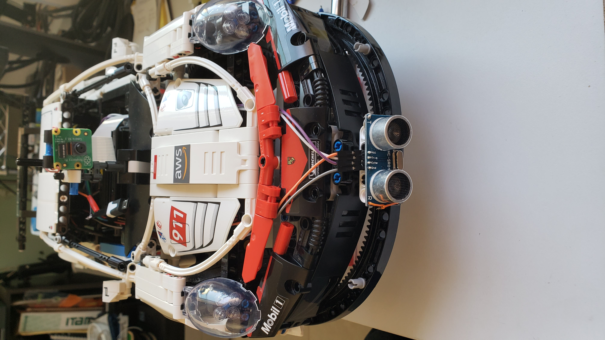
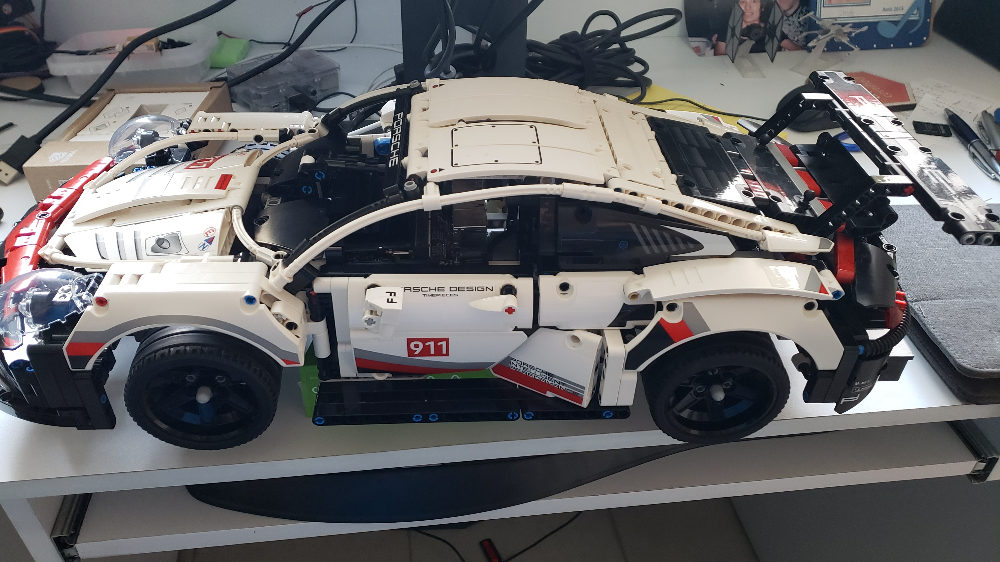
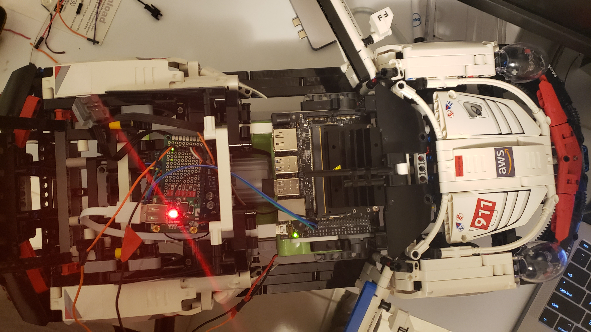

# Autonomous CAR

This repo is how to build  an autonomous car using Jetson Nano, Arduino and LEGO 

## Content
- Lego vehicle
- Electronic and motors
- Machine Learning

This is the final result

 

 

